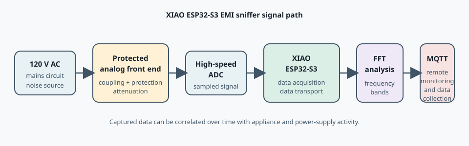

# Documentation

Supporting documentation for design decisions, build procedures, operating limits, and experimental notes.

## System overview

The system captures conducted interference from a 120 V AC circuit, conditions and samples the signal, analyzes selected blocks with an FFT, and publishes periodic reports for remote monitoring.

Open the [system overview illustration](system-overview.svg) separately for the full-size SVG.

## Firmware reference

The [firmware documentation](firmware/README.md) describes the implementation in detail, including:

- ADS7049 wiring, SPI framing, and DMA acquisition.
- FreeRTOS tasks and FFT scheduling.
- Transfer-function correction and analyzed frequency bands.
- MQTT behavior and the JSON report schema.
- Required local `secrets.h` configuration.
- PlatformIO build and upload commands.

The source implementation is available at [firmware/xiao-esp32s3/src/main.c](../firmware/xiao-esp32s3/src/main.c).
