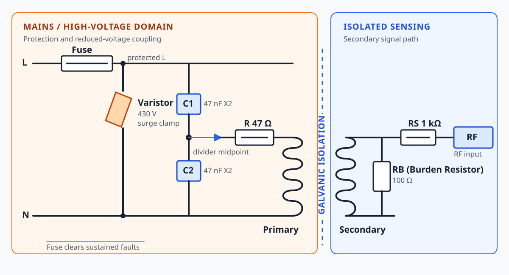

# AC Front End

Mains-side coupling and protection for the EMI sniffer.

## Important safety notice

This project interfaces with potentially lethal mains voltage. A prototype must not be connected to a 120 V AC circuit unless the designer has verified the isolation, creepage, clearance, protection, enclosure, and measurement procedure. Do not touch, probe, or modify an energized circuit.

This project is for qualified experimenters and engineering evaluation. It is not a certified measurement instrument, electrical safety device, or substitute for an approved EMI receiver.

The hardware, firmware, schematics, PCB designs, and documentation are provided for experimental and educational purposes only. Use at your own risk. The authors provide no warranty and accept no responsibility for injury, death, property damage, electrical damage, fire, or any other loss resulting from the use, modification, construction, or operation of this project.

## Circuit description

### AC Protection

A fuse (250 mA, 250 V) is connected in series with the line conductor. It
provides overcurrent protection: if a downstream component fails or a fault
causes excessive current, the fuse opens and disconnects the front end from
the mains. The fuse is intended to limit fault energy and protect against
sustained overcurrent; it does not clamp the voltage of a transient.

A metal-oxide varistor (MOV) (430 V) connected across the protected
line and neutral rails, after the fuse. Under normal mains voltage it remains
high impedance. A short overvoltage transient causes the MOV resistance to
fall, diverting surge current across line and neutral and limiting the voltage
applied to the capacitive divider and transformer input.

The fuse and MOV work together: the MOV handles short-duration voltage surges,
while the fuse disconnects the circuit if a fault or an overstressed MOV causes
sustained current to rise. The MOV is not a substitute for the fuse, and
neither component makes the prototype safe to touch or suitable for connection
to mains without the required insulation, spacing, enclosure, and verification.

## RF Front-End Coupling Network

The RF front end uses a symmetrical capacitive coupling network to interface the mains line-to-neutral voltage with a sensing transformer while limiting the direct transfer of the mains waveform into the measurement circuit.

Two series-connected safety-rated capacitors are placed across the line and neutral conductors, with the transformer primary connected to their midpoint through a series damping resistor. This configuration forms a capacitive divider that attenuates the mains voltage applied to the transformer while providing galvanic isolation between the mains conductors and the low-voltage signal-processing circuitry.

The series resistor limits transient and RF current and provides damping of resonances associated with the transformer and parasitic capacitances. The transformer converts the resulting RF voltage into an isolated low-level signal suitable for subsequent amplification and digitization.

The network is intended to provide a relatively flat response over the project's RF measurement band while strongly attenuating the 60 Hz mains component. Safety-rated capacitors are used for all components directly connected to the mains.

## Why C1 and C2 must be X2 capacitors

C1 and C2 are directly connected to the mains circuit and can be exposed to
both the continuous line voltage and mains switching or lightning transients.
They must therefore be certified Class X2 safety capacitors, with a suitable
AC voltage and impulse rating. X2 capacitors are designed for across-the-line
use and are constructed to fail in a controlled, self-clearing manner rather
than creating a hazardous short circuit.

Do not substitute ordinary ceramic, film, or general-purpose capacitors. X2 is
the appropriate safety class here because these capacitors are connected
between line and neutral; capacitors connected from either conductor to
protective earth would require the appropriate Y safety class instead. The
fuse, MOV, spacing, and component ratings remain part of the complete mains
safety design and do not make an uncertified capacitor acceptable.

## Design files

- Overview illustration: `schematic/ac-front-end-overview.svg`
- Schematic: `schematic/Schematic_RF_EMI_2026-09-12.pdf`
- Schematic source export: `schematic/Schematic_RF_EMI_2026-09-12.svg`
