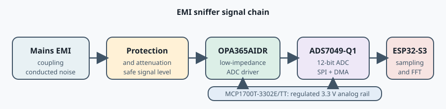

# Signal-Analysis Circuit

Analog conditioning and acquisition circuitry between the AC front end and the XIAO ESP32-S3.

## Signal-chain position

The intended signal chain is illustrated below:

Open the [signal-chain illustration](signal-chain.svg) separately for the standalone SVG.

The OPA365AIDR is the active analog interface between the EMI coupling/protection network and the ADC. It buffers the conditioned signal, presents a low-impedance source to the ADS7049-Q1, and preserves the high-frequency waveform for digital sampling and FFT analysis.

The signal path is powered by a separate regulated 3.3 V analog rail generated by the MCP1700T-3302E/TT. Local bypass capacitors at the OPA365AIDR and ADS7049-Q1 provide a low-impedance supply during high-frequency analog operation and ADC sampling.

## ADC selection: ADS7049-Q1

The signal-analysis stage uses the Texas Instruments ADS7049-Q1 as its ADC. This choice matches the project's combination of wideband conducted-noise measurement, modest analog complexity, and local FFT processing on the XIAO ESP32-S3.

### Why it fits

- **Sampling speed:** up to approximately 1 MSPS provides useful measurement bandwidth into the hundreds of kilohertz. With the current approximately 1.08 MSPS operating point, the Nyquist frequency is approximately 540 kHz, above the current region of interest.
- **12-bit resolution:** provides useful dynamic range for distinguishing EMI components while keeping the converter practical for a low-cost open design.
- **SPI interface:** connects naturally to the ESP32-S3 and supports continuous acquisition with SPI and DMA without requiring a parallel bus.
- **Single-ended input:** matches the analog front end, which conditions and biases the EMI signal around approximately 1.65 V before the ADC input.
- **Simple input drive:** the relatively low input capacitance and straightforward drive requirements make the device suitable for the OPA365 buffer stage without an unnecessarily complex ADC driver.
- **Small and economical:** supports the project's goal of a reproducible, accessible instrument rather than a laboratory-grade EMI receiver.
- **Automotive-qualified (-Q1):** not required for a residential experiment, but useful evidence that the component is designed for demanding electrical environments.

The important choice is the combination of sampling speed, SPI, ESP32-S3 DMA, and FFT processing rather than any single ADC specification.

## ADC driver selection: OPA365AIDR

The Texas Instruments OPA365AIDR is used between the coupling/protection network and the ADS7049-Q1. Its characteristics are well matched to the project's approximately 1 MHz sampling rate, 50-250 kHz EMI region, 3.3 V single-supply operation, and ADC input biased around approximately 1.65 V.

### Why it fits

- **50 MHz gain bandwidth:** provides substantial bandwidth headroom above the sampling rate and target EMI region, reducing the risk that the amplifier becomes the limiting element.
- **Low noise:** the specified 4.5 nV per square root hertz at 100 kHz is relevant when detecting relatively small conducted-noise signals.
- **25 V/us slew rate:** is suitable for preserving the fast waveform content being sampled.
- **Rail-to-rail input and output:** supports a low-voltage single-supply design and the signal's approximately 1.65 V bias point. The input common-mode range also extends approximately 100 mV beyond the supply rails.
- **ADC-driver suitability:** provides the fast, low-impedance source needed to drive a switched-capacitor SAR ADC input.
- **Low distortion and high CMRR:** the zero-crossover input architecture, minimum 100 dB CMRR, and specified 0.0004% THD+N support preservation of small high-frequency signals around the bias point.
- **2.2-5.5 V supply range:** works with the low-voltage supply available to the digital system.
- **SOIC-8 package:** the AIDR variant is practical for assembly and hand rework compared with a miniature wafer-level package.

### Role in the ADS7049-Q1 interface

The ADS7049-Q1 is a switched-capacitor SAR ADC. Its sampling action periodically draws charge from the preceding analog stage, so the driver must settle quickly and provide a low source impedance between conversions. The OPA365AIDR performs that buffering and ADC-drive function; it is not only a gain stage.

The detailed gain, feedback network, output isolation, bias generation, supply decoupling, and stability requirements remain part of the hardware design validation. They must be confirmed against the final schematic, PCB layout, ADC input network, and the OPA365 and ADS7049-Q1 data sheets.

## Analog supply regulator: MCP1700T-3302E/TT

The MCP1700T-3302E/TT provides the dedicated regulated 3.3 V analog supply for the OPA365AIDR and ADS7049-Q1. It is selected for the low-power analog front end because it combines low-dropout operation, low quiescent current, 250 mA output capability, and a compact SOT-23 package.

The separate analog rail helps isolate the signal-conditioning and ADC circuitry from variations and digital activity on the upstream power supply. Local bypass capacitors are placed at the OPA365AIDR and ADS7049-Q1 to reduce supply impedance at high frequencies and support the ADC's sampling transients.

### Firmware integration

The firmware drives the ADS7049-Q1 through SPI2 using:

- D1 / GPIO2 as the frame signal, generated through the MOSI output.
- D8 / GPIO7 as SCLK.
- D9 / GPIO8 as SDO / MISO.
- A requested SPI clock of 24 MHz and a 24-clock frame per conversion.
- Two DMA buffers containing 1024 samples each.

See the [firmware reference](../../docs/firmware/README.md) and the [firmware source](../../firmware/xiao-esp32s3/src/main.c) for the implemented framing, decoding, sampling-rate calculation, clipping checks, and FFT pipeline.

## Hardware documentation

### Schematic

- [Schematic PDF](schematic/Schematic_EMI_sniffer_digital_v3_2026-09-12.pdf)
- [Schematic SVG](schematic/Schematic_EMI_sniffer_digital_v3_2026-09-12.svg)

### PCB

- [PCB layout PDF](pcb/PCB_PCB_EMI_ADC_XIAO_2026-09-12.pdf)
- [PCB layout SVG](pcb/PCB_PCB_EMI_ADC_XIAO_2026-09-12.svg)
- [PCB layout preview](pcb/PCB_PCB_EMI_ADC_XIAO_2026-09-12.png)

### Manufacturing

- [Bill of materials](manufacturing/BOM_EMI_sniffer_digital_v3_2026-09-12.csv)
- [Assembly photo](manufacturing/PXL_20260912_150831035.jpg)

### To be added

- Circuit description and design limits.
- Frequency-response, noise, and dynamic-range measurements.
